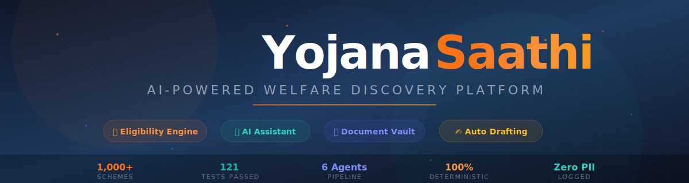

<div align="center">



<br/>

An intelligent, multi-agent welfare eligibility platform that turns a single citizen profile into an auditable, ranked catalog of eligible central and state government schemes — complete with document gap detection, automated OCR extraction, and instant application drafting.

[](https://github.com/Yojana-Saathi/Yojana-Saathi)
[](CONTRIBUTING.md)
[](https://yojana-saathi-seven.vercel.app)
[](https://yojanasaathi-backend.onrender.com/api/health)
[](https://github.com/Yojana-Saathi/Yojana-Saathi/actions)
[](LICENSE)

<br/>

[](https://www.python.org/)
[](https://fastapi.tiangolo.com/)
[](https://nextjs.org/)
[](https://supabase.com/)
[](https://groq.com/)
[](Backend/tests)

<br/>

[**Live Demo**](https://yojana-saathi-seven.vercel.app) · [**Explore Architecture**](#-system-architecture) · [**Quickstart**](#-quickstart) · [**API Reference**](#-api-reference) · [**Security**](#-security--privacy-first-engineering) · [**Team**](#-core-team--maintainers)

</div>


## 🎯 Executive Summary & Mission

India administers over **3,000+ central and state welfare schemes** representing billions of dollars in annual budget allocations for agriculture, education, healthcare, housing, pensions, and social welfare. Despite guaranteed funding, **over ₹1,00,000+ Crore in benefits remain unclaimed every year** due to fragmentation, complex legalese, missing documentation, and discovery barriers.

**YojanaSaathi solves this at scale.** 

By uniting a **100% deterministic Python eligibility rule engine** with a **zero-latency Groq AI assistant**, YojanaSaathi allows citizens to input their profile once and immediately receive:
- **Instant Eligibility Matching**: Exact percentage match score computed against 1,000+ scheme rule definitions.
- **Missing Document Gap Analysis**: Precise identification of missing credentials needed for 100% approval readiness.
- **Automated Document OCR Vault**: Instant parameter extraction from Aadhaar, Income Certificates, and Ration Cards.
- **Auto-Generated Application Letters**: One-click custom application letter generation tailored for issuing authorities.


## ✨ Key Platform Features

| Feature | Description | Architecture Highlights |
|---|---|---|
| 🎯 **Auditable Eligibility Engine** | Pure deterministic rule matching engine evaluating demographics, income caps, land holdings, social categories, and state criteria. | **Zero AI Hallucination**: LLMs never make legal eligibility decisions. |
| 🧠 **AI Saathi Assistant** | High-speed conversational AI assistant powered by Groq Llama-3.3-70B with domain-specific synonym expansion. | Low-latency inference (`temperature=0.2`), zero hesitation, and structured formatting. |
| 📄 **OCR Document Vault** | Multi-document upload area powered by OCRSpace. Extract text, auto-fill profile indicators, and verify status. | Transient signed URLs (300s TTL) with PostgreSQL Row-Level Security (RLS). |
| ✍️ **Instant Application Drafter** | Generates pre-filled, formal application letters for any eligible scheme on demand. | Template fallback mechanism ensures 100% uptime even if AI providers are unreachable. |
| ⚡ **Real-Time Event Sync** | Automated profile and scheme change triggers that re-evaluate matches instantly across all active users. | Supabase Deno Edge Functions broadcasting webhooks to FastAPI match endpoints. |
| 🛡️ **Enterprise Security** | Bank-grade security controls including strict CORS allowlists, per-IP rate limiting, and zero-PII logging. | Sanitized inputs, anti-prompt injection guardrails, and JWT role verification. |


## 🏛️ System Architecture

```
                                  ┌──────────────────────────────────────────┐
                                  │           Next.js 16 Frontend            │
                                  │  (Dashboard, Chat, Vault, Settings UI)   │
                                  └────────────────────┬─────────────────────┘
                                                       │
                                            HTTPS / REST (JWT Auth)
                                                       │
                                                       ▼
                                  ┌──────────────────────────────────────────┐
                                  │           FastAPI Engine API             │
                                  │    (Pydantic v2, Rate Limiter, CORS)     │
                                  └────┬───────────────┬─────────────────┬───┘
                                       │               │                 │
            ┌──────────────────────────┘               │                 └──────────────────────────┐
            ▼                                          ▼                                            ▼
┌───────────────────────┐          ┌───────────────────────┐                    ┌───────────────────────┐
│ Multi-Agent Pipeline  │          │   Groq AI Inference   │                    │ Supabase Platform     │
│  - Intake Agent       │          │ (Llama-3.3-70B Engine)│                    │  - Postgres DB & RLS  │
│  - Eligibility Agent  │          └───────────────────────┘                    │  - Auth (GoTrue)      │
│  - Ranking Agent      │                                                       │  - Storage Buckets    │
│  - DocGap Agent       │          ┌───────────────────────┐                    │  - Edge Functions     │
│  - Drafter Agent      │─────────▶│    OCRSpace Engine    │                    └───────────────────────┘
└───────────────────────┘          │ (Document OCR Parser) │
                                   └───────────────────────┘
```


## 🤖 Autonomous Agent Pipeline

Every profile update triggers our multi-agent orchestration pipeline. All financial and eligibility decisions remain **100% deterministic, transparent, and reproducible**:

```
                       ┌────────────────┐
                       │  Citizen Input │
                       └───────┬────────┘
                               │
                               ▼
                    ┌──────────────────────┐
                    │     Intake Agent     │ ── Validates schema & sanitizes HTML/scripts
                    └──────────┬───────────┘
                               │
                               ▼
                    ┌──────────────────────┐
                    │  Eligibility Agent   │ ── Pure rule evaluation against 1,000+ schemes
                    └──────────┬───────────┘
                               │
                               ▼
                    ┌──────────────────────┐
                    │    Ranking Agent     │ ── Sorts by estimated benefit value × confidence
                    └──────────┬───────────┘
                               │
                               ▼
                    ┌──────────────────────┐
                    │    DocGap Agent      │ ── Computes missing required credentials
                    └──────────┬───────────┘
                               │
                               ▼
                    ┌──────────────────────┐
                    │    Drafter Agent     │ ── Generates formal application letters
                    └──────────────────────┘
```


## 🧱 Production Tech Stack

### **Backend Services**
* **Language & Framework**: Python 3.12, FastAPI 0.115, Pydantic v2
* **Server**: Uvicorn, Gunicorn
* **Security & Auth**: PyJWT, Supabase Auth Middleware, SlowAPI Rate Limiter
* **AI & LLM**: Groq Async SDK (`llama-3.3-70b-versatile`, `llama-3.1-8b-instant`)
* **OCR**: OCRSpace REST API Integration
* **Logging & Observability**: `structlog` (JSON format), Sentry SDK

### **Frontend Client**
* **Framework**: Next.js 16.2 (App Router, React 19.2)
* **Language & Styling**: TypeScript 5, Tailwind CSS 4, Lucide Icons, GSAP Animations
* **State & Data Fetching**: React Hooks, Context API, Supabase JS Client v2

### **Database & Cloud Infrastructure**
* **Database**: Supabase PostgreSQL with Trigram Full-Text Search Indexes
* **Security Policies**: Row-Level Security (RLS) on all user tables
* **Edge Execution**: Deno-based Supabase Edge Functions (`on-profile-change`, `on-scheme-change`)
* **CI/CD & Hosting**: GitHub Actions CI, Vercel (Frontend), Render (Backend API)


## ⚡ Quickstart & Local Setup

### **Prerequisites**
* **Python 3.12+**
* **Node.js 20+**
* **Git**

### **1. Clone the Repository**
```bash
git clone https://github.com/Yojana-Saathi/Yojana-Saathi.git
cd Yojana-Saathi
```

### **2. Setup & Launch Backend**
```bash
# Navigate to Backend
cd Backend

# Create & activate virtual environment
python -m venv .venv
# On Windows:
.venv\Scripts\activate
# On macOS/Linux:
source .venv/bin/activate

# Install dependencies
pip install -r requirements.txt

# Environment Setup
cp .env.example .env
# Fill in your Supabase credentials in .env

# Run API from repository root
cd ..
py -m uvicorn Backend.main:app --reload --port 8000
```
Backend will be live at `http://localhost:8000`. Interactive OpenAPI documentation is available at `http://localhost:8000/docs`.

### **3. Setup & Launch Frontend**
```bash
# Open a new terminal and navigate to frontend
cd frontend

# Install dependencies
npm install

# Environment Setup
cp .env.example .env.local
# Fill in NEXT_PUBLIC_API_URL=http://localhost:8000 and Supabase credentials

# Start development server
npm run dev
```
Frontend will be live at `http://localhost:3000`.

### **4. Execute Backend Test Suite**
```bash
# Run pytest across all 121 unit & integration tests
py -m pytest -o asyncio_mode=auto
```


## 📡 API Reference Overview

Base URL: `https://yojanasaathi-backend.onrender.com/api`

### **Authentication & Profile Endpoints**

| Endpoint | Method | Auth | Description |
|---|---|---|---|
| `/api/intake` | `POST` | Bearer JWT | Submits citizen profile, executes matching pipeline, and returns eligible schemes. |
| `/api/matches/refresh` | `POST` | Bearer JWT | Re-evaluates matches for logged-in user profile against the live catalog. |
| `/api/matches` | `GET` | Bearer JWT | Fetches saved eligibility matches for the current user. |
| `/api/user` | `DELETE` | Bearer JWT | Cascadingly deletes user matches, documents, applications, and auth account. |

### **Document Vault & OCR Endpoints**

| Endpoint | Method | Auth | Description |
|---|---|---|---|
| `/api/documents/upload` | `POST` | Bearer JWT | Uploads document to private bucket and executes OCR text extraction. |
| `/api/documents/{doc_id}/confirm` | `POST` | Bearer JWT | Confirms OCR parameters and updates profile indicators in database. |
| `/api/documents` | `GET` | Bearer JWT | Returns list of uploaded documents with temporary signed URLs (300s TTL). |

### **Assistant & Draft Endpoints**

| Endpoint | Method | Auth | Description |
|---|---|---|---|
| `/api/chat` | `POST` | Public | High-speed AI Saathi conversational assistant endpoint. |
| `/api/draft/{scheme_id}` | `GET` | Bearer JWT | Generates pre-filled formal application letter for a specific scheme. |

### **Public & Utility Endpoints**

| Endpoint | Method | Auth | Description |
|---|---|---|---|
| `/api/schemes/search` | `GET` | Public | Full-text search across all 1,000+ active welfare schemes. |
| `/api/health` | `GET` | Public | Liveness probe returning operational status and active agent listing. |


## 🔒 Security & Privacy-First Engineering

YojanaSaathi is engineered around strict data security and compliance principles:

1. **Zero AI Decisions on Legal Eligibility**: LLMs are restricted strictly to natural language formatting and chat guidance. Eligibility matching is 100% deterministic code.
2. **PostgreSQL Row-Level Security (RLS)**: User demographic records, uploaded document metadata, and match scores are strictly scoped to the authenticated owner's `user_id`.
3. **Zero PII Logging**: Structured JSON logs (`structlog`) strip out names, phone numbers, addresses, and document contents.
4. **Short-Lived Storage Access**: Uploaded credentials in Supabase Storage buckets are private; signed access URLs expire automatically after 300 seconds.
5. **CORS Allowlist Enforcement**: Production API rejects wildcard `*` origins at startup.


## 👥 Core Team & Maintainers

<table align="center">
  <tr>
    <td align="center" width="50%">
      <a href="https://github.com/PREMRAJESH">
        <br />
        <sub><b>Prem Rajesh Sargara</b></sub>
      </a><br />
      <sub>Founder, Backend & Project Lead</sub><br />
      <small>Backend Architecture, FastAPI, Multi-Agent Engine, Security & CI/CD</small>
    </td>
    <td align="center" width="50%">
      <a href="https://github.com/Dvij-Joshi">
        <br />
        <sub><b>Dvij Joshi</b></sub>
      </a><br />
      <sub>Co-Founder & Frontend Lead</sub><br />
      <small>Next.js Frontend, UI/UX Systems, Auth Integration & Document Vault</small>
    </td>
  </tr>
</table>


## 📄 License & Legal Notice

Distributed under the **MIT License**. See [`LICENSE`](LICENSE) for details.

*Disclaimer: YojanaSaathi is an independent assistive discovery platform. Eligibility match scores are calculated estimates based on encoded official guidelines. Official decisions rest solely with respective Government issuing authorities.*

<div align="center">


</div>
